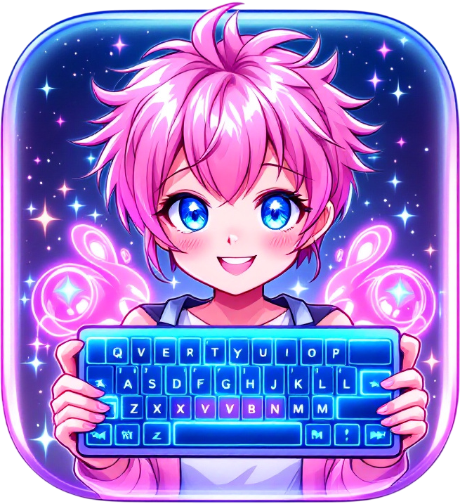

# Repeat What Shit

  

Надоел софт для мышек, который писал бомж на чекушку водки? (Это еще одна) \
Надоел софт, который просят их оплатить, за то, что их автор смог вызвать пару функций WinAPI?

Попробуй эту поделку, макрос - это просто список клавиш \ их комбинаций с задержкой, который ты потом просто привязываешь к любой клавише \ списку клавиш активации.

Можно указать в какой конкретно программе работает макрос (по заголовку окна, классу или имени процесса) \
Так же есть три режима макро: сработать по нажатию, спамить пока зажаты клавиши активации, вкл \ выкл повтора макроса по нажатию макро.

Пока эмулирует только сами по себе нажатия кнопок, умеет эмулировать нажатия клавиш мыши или биндить макрос на них, но кликать по конкретным координатам - пока нет (а может никогда и не будет уметь).

## Установка

1. Скачайте последнюю версию из раздела [Releases](https://github.com/d0kur0/repeat-what-shit/releases)
2. Portable версию можно запустить из любой директории, не требует установки
3. NSIS версию можно установить в любое место (Это буквально установщик)
